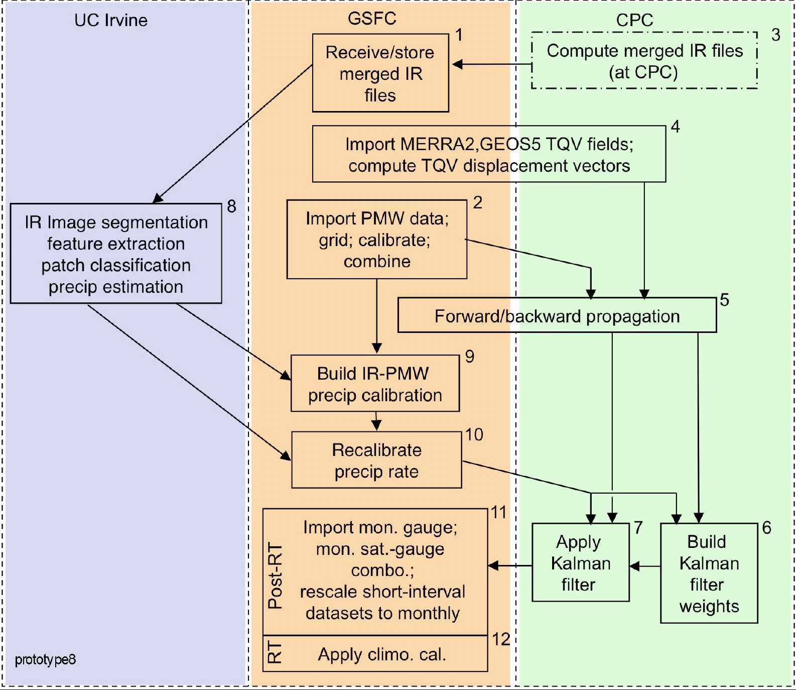

# 20 years precipitation data analysis

## Table of Contents

- [Project Description](#description)
- [Data Acquisition](#data)
- [Research Direction](#direction)
- [Results](#results)
- [TODO List](#todo)
- [Updates](#updates)

## Project Description

This project is meant to analyze 20 years precipitation data globally with remote sensing sources. NASA has launched IMERG(Integrated Multi-satelliteE Retrivals) product for producing global precipitation during last 20 years. It involves several observation products from **core satellites** e.g. _TRMM_, _GPM_, **Microwave constellations**, **IR constellations**, **Additional satellites**, **Precipitation gauges**. One can see the flowchart of this product in figure below,

Description of the theoritical difference between each product can be found: https://pmm.nasa.gov/content/what-are-differences-between-imerg-early-late-and-final-runs-and-which-should-be-used

## Data Acquisition
All the required data can be found in NASA website, free to download. The products consist of three stages, early run only considered formard morphing and without gauge data calibration, latency of ~4 hrs after observation, late run considered both forward and backward morphing, without gauge data calibration, has latency of ~14 hrs after observation, while final run has forward and backward run, with gauge calibration, but with latency of ~3.5 month after observation.

To be continued...

### Data resolution
All the early run and final run are analyzed based on half hour frequency and 0.1 degree by 0.1 degree spatial resolution.

## Research Direction

This project will start with some question-orientated directions.

    1. Which part of the earth rains the most during the last 20 years?

    2. Explainable reason why it rains the most

    3. What is the relationship between early run and final run. Does the final run suffer from over-calibration?
    
We established two-step research:

    1. In the first step, we intend to stand on the top, looking at global scale, including the differences and variability and then explanation of them.
    
    2. Second step, we will specify a research area that conflicts the most after first glance. try to understand why this local information violates a lot.
    
### First step

Some statistical metrics used in the first study

|stats|representativeness|note|
|-----|------------------|----|
|`$$r^2$$`|pixel-wise|describe the trend following|
|RMSE|pixel-wise|describe the difference|
|normRMSE|pixel-wise|describe the difference taking out the rain tensity effect|
|bias ratio|pixel-wise|describe over-estimation/underestimation|
|variability ratio|pixel-wise|`$$\gamma=\frac{\sigma_s/S}{\sigma_G/G}$$`|

## Results
Will update after get results

## TODO List
- [x] completes data acquisition part
- [x] produce a map containing total amount rainfall during 20 years
- [x] basic statistics information describing early run and final run e.g. RMSE, MAE, pearsonr, and along with normalized value

## Update
    2019.10.28 finished global statistical calculaiton, decomposed difference into latitudes, climatological zones, different terrains.
    2019.9.6 finished read 'Global intercomparison and regional evaluation of GPM IMERG'
    2019.9.3 initiate README
